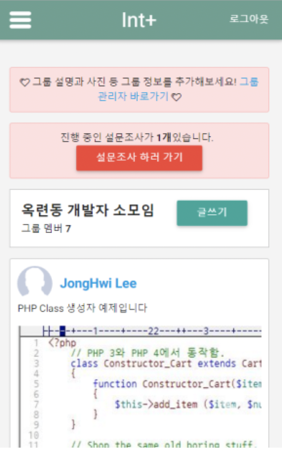
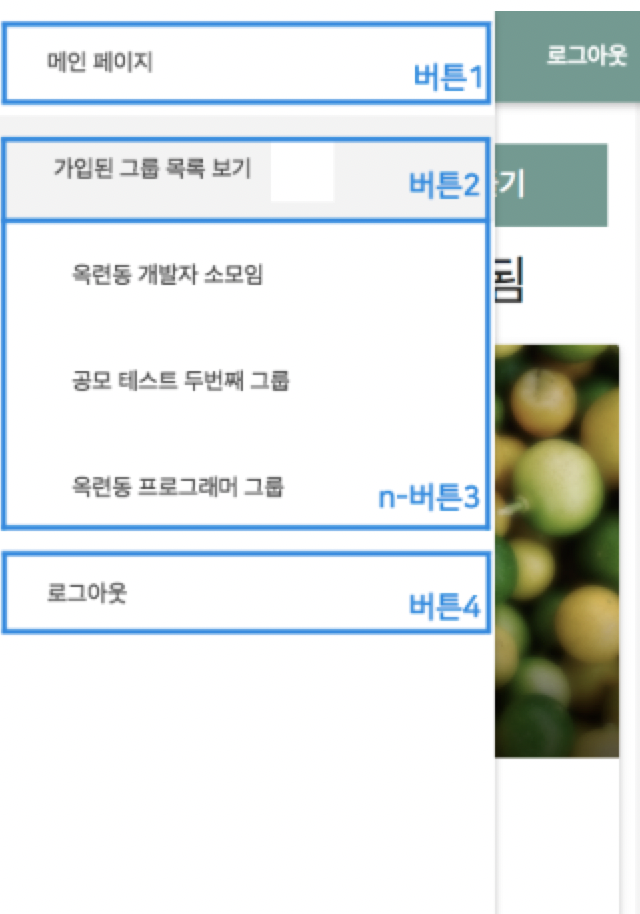
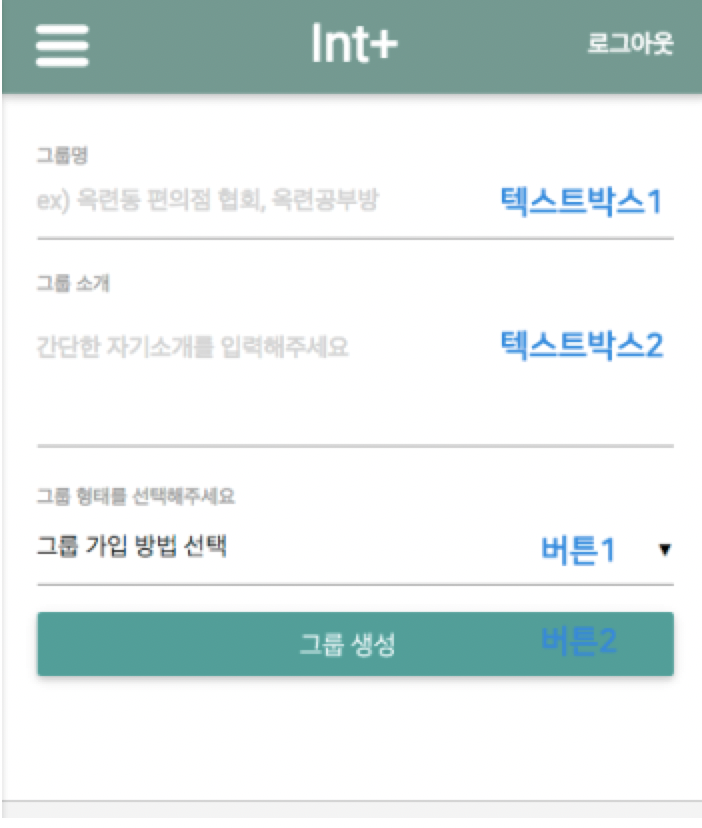

# Int Plus server
그룹웨어 SNS Int Plus의 PHP서버입니다.

# How to install

Install apache2 or nginx

Install php7.0 (nginx : php-fpm)

Install MariaDB

--------------------------
Make directory /config/
## db.config.php
Make file /config/db.config.php

~~~
<?php
	
	$_dbinfo['host'] = "DB HOST";
	$_dbinfo['id'] = "DB ID";
	$_dbinfo['pw'] = "DB PW";
	$_dbinfo['db'] = "DB NAME";

	$mysqli = new mysqli($_dbinfo['host'], $_dbinfo['id'], $_dbinfo['pw'], $_dbinfo['db']);

	if(mysqli_connect_error()){
		exit("Database Connect error.");
	}

?>
~~~

## security.config.php
Make file /config/db.config.php

~~~
<?php
	$arrkey = @array_keys($_GET);

	if(!$_GET['mid']){
		$_GET['mid'] = "index";
	}
	
	session_start();
	
	function itube_sha($pass){
		return sha1(sha1(urlencode($pass)) . "RANDOM STRING");
	}

	function c_url_return($url){
		$ch = curl_init($url);
		curl_setopt_array($ch, array(
			CURLOPT_HEADER         => FALSE,
			CURLOPT_RETURNTRANSFER => TRUE,
			CURLOPT_FOLLOWLOCATION => TRUE,
			CURLOPT_SSL_VERIFYPEER => FALSE,
			CURLOPT_MAXREDIRS      => 5,
			CURLOPT_CONNECTTIMEOUT => 15,
			CURLOPT_TIMEOUT        => 30,
			CURLOPT_ENCODING	   => 'gzip',
			CURLOPT_FRESH_CONNECT  => FALSE,
		));
		$data = curl_exec($ch);
		curl_close($ch);

		return $data;
	}

	function __autoload($className){
		require ("./func/" . $className . ".php");
	}
?>
~~~

# 데이터베이스 스키마

# 애플레케이션 구동화면

